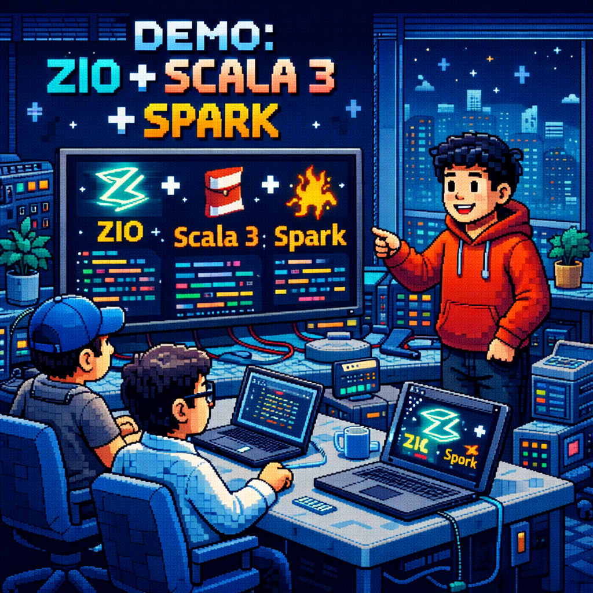

# 🧗‍Scala Clean User Microservice

<p align="left">
    <!--img src="./src/main/resources/images/schema-user-microservice.png" /-->
</p>
<p align="left">
    
    
    
     
</p>

### Overview 

This project is a microservice for managing user accounts in a banking application.
This microservice handles authentication, authorization and JWT (signature with private and public keys). 
It provides secure token issuance, validation, and user authentication for client applications.

It is built using Scala and follows the principles of Clean Architecture.

The microservice provides functionalities for creating, retrieving, updating, and deleting user accounts, 
as well as handling authentication and authorization.

This microservice issues a JWT token (signed with a private key) to the user. The user then uses the JWT 
to access data from other microservices. The user sends the JWT token to the API Gateway microservice, 
which verifies the JWT on its side using the public key. If the JWT token has expired, it is refreshed 
using the Refresh Token.
 
In this microservice, you can use the following URLs:

```GET https://scala-user-microservice/api/v1/login```

```GET https://scala-user-microservice/api/v1/refresh-token```

```GET https://scala-user-microservice/api/v1/users/{id}```

```POST https://scala-user-microservice/api/v1/users/add```

```PATCH https://scala-user-microservice/api/v1/users/{id}```

```DELETE https://scala-user-microservice/api/v1/users/{id}```

### Structure of the project

```
scala-clen-user-microservice/
├─ project/
├─ src/
│  ├─ main/
│  │  ├─ scala/
│  │  │  ├─ controllers/
│  │  │  │  ├─ HomeController.scala
│  │  │  │  └─ UserController.scala
│  │  │  │
│  │  │  ├─ models/
│  │  │  │  └─ User.scala
│  │  │  │
│  │  │  ├─ services/
│  │  │  │  └─ JwtService.scala
│  │  │  │
│  │  │  └─ Main.scala
│  │  │
│  │  └─ resources/
│  │     └─ images/
│  │     └─ application.conf
│  │
│  └─ test/
│        └─ UserControllerSpec.scala
└─ build.sbt
```

### Features

- Scala 3 + ZIO http + Spark + PostgreSQL 
- Scala 3.3.1 + sbt 1.9.9
- Authentication and authorization
- JWT token issuance and validation
- Refresh token mechanism
- User account management (CRUD operations)
